# RecoverAI — Autonomous Revenue Recovery Agent

> RecoverAI detects failed payments, determines why revenue is at risk, chooses the safest
> recovery action, executes it through a bounded workflow, and measures how much revenue was recovered.

**One sentence for judges:** RecoverAI combines an LLM-based decision agent with a deterministic
policy engine and a Razorpay test-mode action layer to autonomously recover failed payments while
enforcing spending limits, retry limits, escalation rules, and a complete audit trail.

```
FAILED PAYMENT → OBSERVE → REASON (LLM) → POLICY GATE → ACT → VERIFY → AUDIT
                                              │
                               ALLOW ─────────┴───────── BLOCK / DOWNGRADE
                                 │                            │
                          Retry / Pay link              Human escalation
```

**The LLM recommends actions. It never has unrestricted access to money movement.**

<p align="center">
  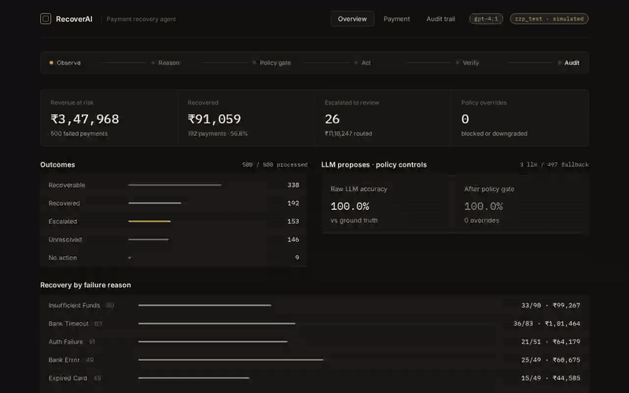
</p>

<p align="center"><em>65-second walkthrough — Run recovery on 500 failed payments → P0042 retried & recovered → P0099 blocked by policy & escalated → P0210 stale event refused → audit trail.</em><br>
<a href="docs/media/full.mp4">▶ full.mp4</a> · <a href="docs/media/">all clips</a></p>

## Demo videos

| Clip | What it shows | |
|---|---|---|
| **Live batch run** · 40s | Reset → Run recovery → progress bar, stepper on *Act*, decisions streaming into the table, KPIs updating live | [gif](docs/media/run.gif) · [mp4](docs/media/run.mp4) |
| **Recovered** · 13s | P0042 — bank timeout, 88% history → *retry* → 9/9 policy checks ✓ → ₹2,499 recovered → audit trail | [gif](docs/media/recovered.gif) · [mp4](docs/media/recovered.mp4) |
| **Escalated** · 12s | P0099 — ₹12,999 repeated failure → policy gate closes `amount_limit` + `retry_limit` → human review → *Policy checks* audit filter | [gif](docs/media/escalated.gif) · [mp4](docs/media/escalated.mp4) |
| **Blocked & failed** · 11s | P0210 — payment already succeeded, policy refuses any action · P0117 — correct retry, bank declines again → *Unresolved*, budget accounting | [gif](docs/media/stale.gif) · [mp4](docs/media/stale.mp4) |

<details>
<summary>Preview the short clips inline</summary>

**Live batch run**

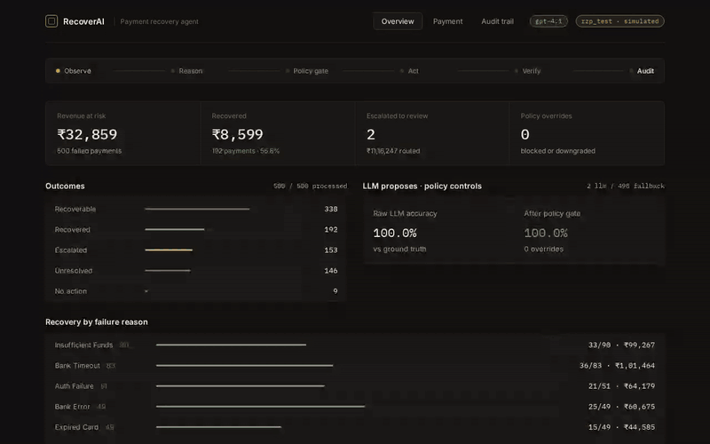

**Recovered (P0042)**

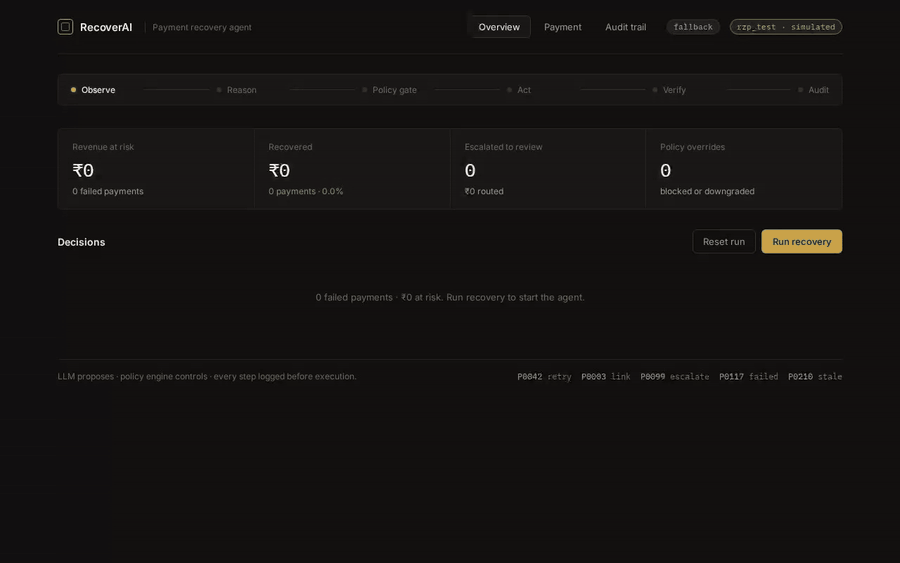

**Escalated (P0099)**

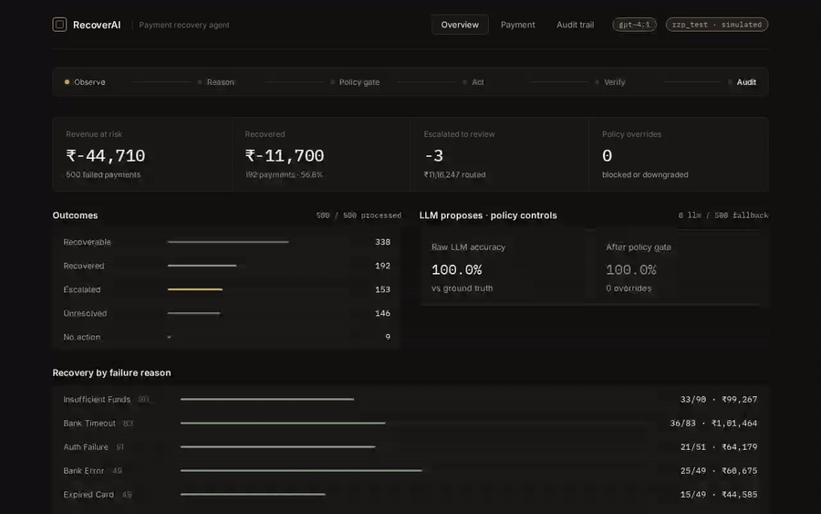

**Blocked stale event (P0210) + failed retry (P0117)**

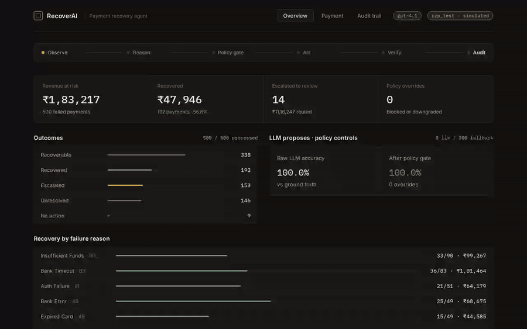

</details>

## Screenshots

| Overview | Payment detail (policy override) | Audit trail |
|---|---|---|
| [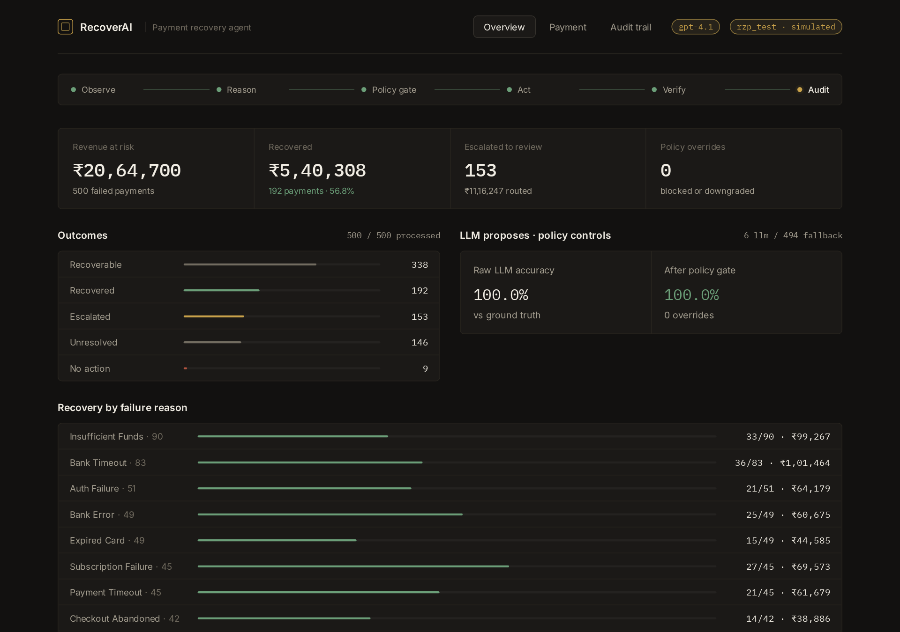](screenshots/01-overview.png) | [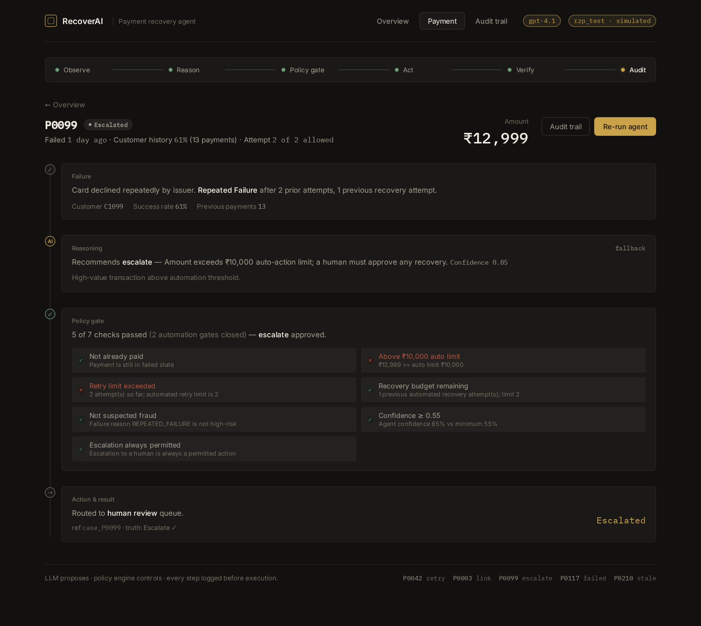](screenshots/06-payment-P0099-escalated.png) | [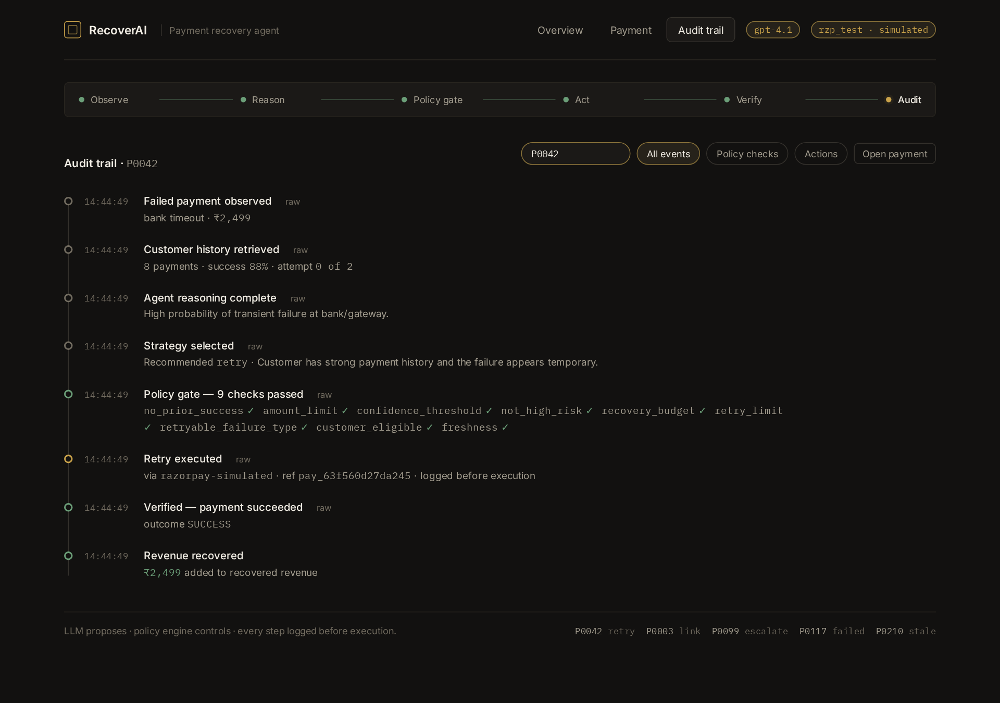](screenshots/10-audit-P0042.png) |

| Live run in progress | Stale event blocked | Payment link recovery |
|---|---|---|
| [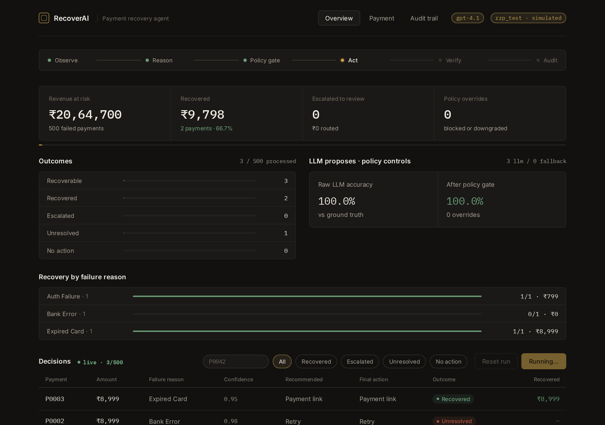](screenshots/03-run-in-progress.png) | [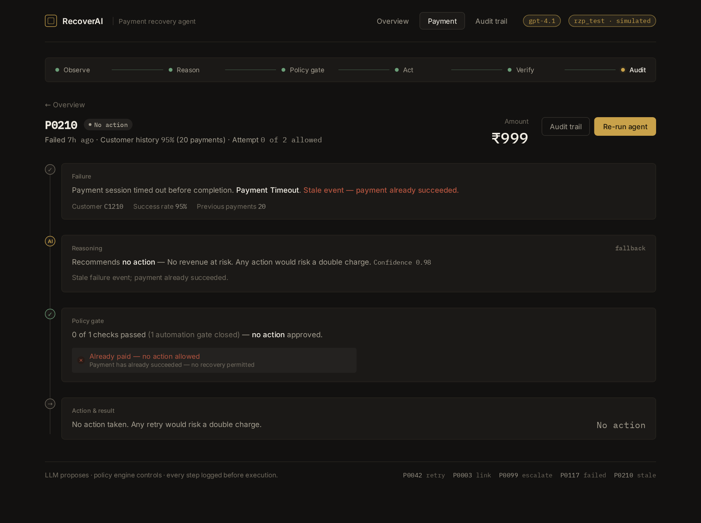](screenshots/08-payment-P0210-stale-event-blocked.png) | [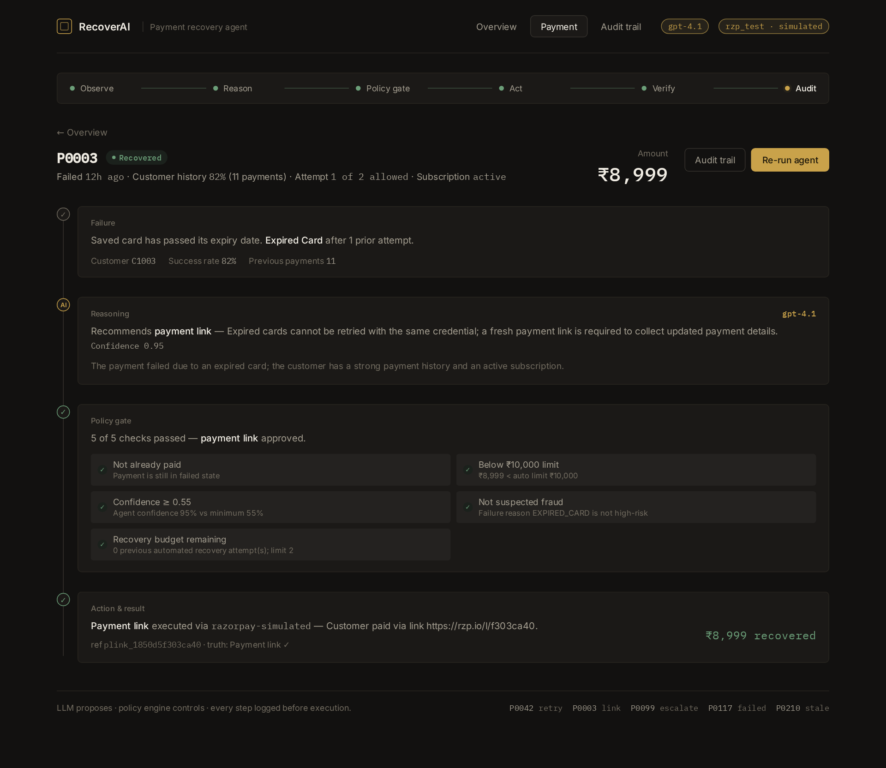](screenshots/05-payment-P0003-payment-link.png) |

13 annotated captures in [`screenshots/`](screenshots/README.md) · re-record media with `scripts/record_media.py` · deploy guide in [`DEPLOY.md`](DEPLOY.md).

## Results at a glance

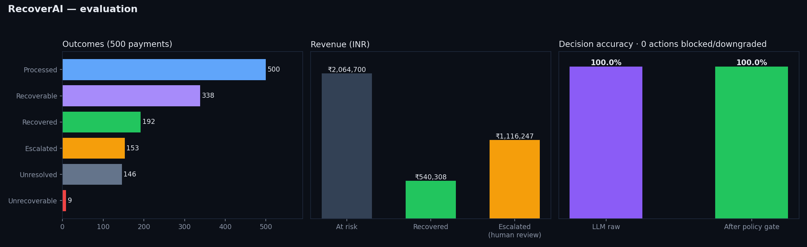

Full tables in **[RESULTS.md](RESULTS.md)** — regenerate with `python backend/evaluate.py --json data/eval.json && python backend/report.py data/eval.json`.

> The chart above is from the deterministic-fallback run. Its 100% accuracy is a pipeline sanity check
> (the fallback and the labeller share rules). **Re-run with `OPENAI_API_KEY` set** to get the real
> LLM-raw vs. post-policy delta — that gap is the safety story.

## Proof against real Razorpay test mode

```bash
RECOVERAI_PROVIDER=razorpay RAZORPAY_KEY_ID=rzp_test_… RAZORPAY_KEY_SECRET=… python backend/razorpay_proof.py
```

This drives the *same* `RazorpayTestMode` adapter the agent uses, creates a real test-mode Payment Link (P0003)
and Order (P0042), and saves the API responses to `docs/razorpay_proof.json`. Then screenshot
**Dashboard → Payment Links / Orders (Test Mode)** and drop it in as `docs/razorpay_dashboard.png`:

<!--  -->

Live keys are refused at construction time (`RuntimeError` unless the key starts with `rzp_test_`).

---

## Quick start

```bash
# 1. backend
cd backend
pip install -r requirements.txt
cp ../.env.example ../.env          # add OPENAI_API_KEY (optional — see below)
python -m uvicorn main:app --host 0.0.0.0 --port 8000 --reload

# 2. frontend (dev mode, proxies /api → :8000)
cd ../frontend
npm install
npm run dev                          # http://localhost:5173

#    or build once and let FastAPI serve it at http://localhost:8000
npm run build
```

The database is seeded automatically with 500 synthetic failed payments on first start
(`data/payments.csv` is regenerated from the same seed).

### Running on a small API budget

The agent has three layers of protection so a batch never stalls on a dead key:
retry with backoff on transient errors → **circuit breaker** (3 consecutive 401/402/403 → fallback for 120 s) →
per-decision `source` tag so metrics separate `llm` from `fallback`. With `LLM_SAMPLE=12` the demo cases are
always LLM-decided and the remaining ~490 use the fallback. Health endpoint shows breaker state.

### Environment

| Variable | Default | Meaning |
|---|---|---|
| `OPENAI_API_KEY` | – | Enables the LLM agent brain. Accepts an OpenAI key (`sk-…`) **or an OpenRouter key (`sk-or-v1-…`)** — base URL and default model (`openai/gpt-4.1`) are auto-detected. Without it a deterministic fallback is used and every decision is tagged `fallback`. |
| `OPENAI_MODEL` | `gpt-4o-mini` / `openai/gpt-4.1` | Any chat model supporting JSON mode. |
| `OPENAI_BASE_URL` | auto | Override for any OpenAI-compatible endpoint. |
| `LLM_CONCURRENCY` | `8` (`2` on OpenRouter) | Max parallel LLM calls. |
| `LLM_SAMPLE` | – | **Hybrid mode for tight budgets**: LLM decides the 5 demo cases + first N−5 payments; fallback handles the rest. Sources stay tagged. |
| `RECOVERAI_USE_LLM` | `1` | Set `0` to force the fallback even with a key. |
| `RECOVERAI_PROVIDER` | `simulated` | `simulated` (Razorpay-shaped mock) or `razorpay` (real test-mode Orders / Payment Links). |
| `RAZORPAY_KEY_ID` / `RAZORPAY_KEY_SECRET` | – | Must be `rzp_test_…`; live keys are refused. |

---

## Architecture

```
backend/
├── main.py          FastAPI routes (/api/payments, /api/agent/*, /api/metrics, /api/audit)
├── orchestrator.py  THE LOOP: observe → reason → policy → act → verify → record
├── agent.py         LLM brain (system prompt, structured JSON output) + deterministic fallback
├── policy.py        Deterministic policy engine — hard limits, stopping rules, downgrades
├── actions.py       Action executor: SimulatedRazorpay | RazorpayTestMode adapters
├── metrics.py       Recovery rate, revenue recovered, decision accuracy, policy overrides
├── dataset.py       500-record synthetic generator + ground-truth labeller + demo scenarios
├── database.py      SQLite (payments, cases, audit)
├── models.py        Pydantic schemas
├── evaluate.py      Batch evaluation CLI → prints the numbers for the results slide
├── report.py        RESULTS.md + docs/results.png from an evaluation JSON
├── razorpay_proof.py  Fires real test-mode Payment Link + Order for the README proof
├── test_policy.py   12 tests proving unsafe recommendations get blocked
└── test_loop.py     5 end-to-end tests (happy path, stale event, rogue agent, failed retry, API)
frontend/src/
├── Dashboard.jsx        Screen 1 — Overview + Run Recovery + decisions table
├── PaymentDetails.jsx   Screen 2 — Failure → AI reasoning → Policy → Action → Result
├── AuditTrail.jsx       Screen 3 — Per-payment timeline ("logged before execution" badges)
└── ui.jsx               Pipeline stepper (the architecture as UI) + animated counters
```

### Separation of powers

| Layer | Who | Can it move money? |
|---|---|---|
| `agent.py` | LLM | **No.** Emits JSON: `recommended_action`, `confidence`, `reason`. |
| `policy.py` | Deterministic code | **No.** Returns `final_action` — may equal, downgrade, or block the recommendation. |
| `actions.py` | Provider adapter | **Yes**, but only receives `policy.final_action`. |

Policy rules (`policy.py`):

- Max **2** automated retries per payment; max 2 previous recovery attempts
- Automated actions only below **₹10,000**; above → escalate
- **Never** act on a payment that already succeeded (stale event guard)
- `SUSPECTED_FRAUD` / `CARD_BLOCKED` → always escalate
- Expired card / weak customer history → retry is *downgraded* to a payment link
- Confidence < 0.55 → escalate rather than guess
- Failures older than 7 days → no auto-retry
- "Give up" on a strong customer with budget remaining → escalate instead (anti-premature-writeoff)

Every check is recorded with pass/fail + human-readable detail and shown on Screen 2.

---

## Deploy (live link for judges)

**Recommended: Vercel (frontend) + Render (API)** — step-by-step in [`DEPLOY.md`](DEPLOY.md).
`frontend/vercel.json` proxies `/api/*` to Render so there's no CORS and no build-time env.

Single-container alternative (FastAPI serves the built React app):

| Target | How |
|---|---|
| **Render** (free) | Push to GitHub → New → Blueprint → picks up `render.yaml`. Add `OPENAI_API_KEY` in env. |
| **Fly.io** | `fly launch --copy-config --no-deploy && fly secrets set OPENAI_API_KEY=… && fly deploy` |
| **Railway** | New project from repo; it detects the `Dockerfile`. Set `OPENAI_API_KEY`. |
| Anywhere w/ Docker | `docker build -t recoverai . && docker run -p 8000:8000 -e OPENAI_API_KEY=… recoverai` |

Split hosting (Vercel frontend + Render API) also works: set `VITE_API_BASE` at build time (`frontend/.env.production.example`).
SQLite is fine for a demo; the DB re-seeds itself on a fresh disk.

## Tests & evaluation

```bash
cd backend
python -m pytest -q           # 17 tests: 12 policy + 5 end-to-end loop/API
python evaluate.py            # LLM if key present
python evaluate.py --no-llm   # fallback
python report.py ../data/eval.json   # RESULTS.md + docs/results.png
```

`test_loop.py` includes a *rogue-agent* test: it monkeypatches the LLM to demand `RETRY_PAYMENT` on a ₹12,999
case and asserts the orchestrator still escalates and never touches the payment provider.

Sample fallback run (500 payments, seed 42):

```
At risk                ₹2,064,700
Recovered              ₹540,308   (192 payments)
Escalated to humans    153        (₹1,116,247 routed for review)
Unresolved             146
Unrecoverable          9
Recovery rate          56.8%      (recovered / 338 recoverable)
Decision accuracy      100.0%     (final action vs ground truth)
```

**Be honest about this on stage:** the fallback encodes the same rules as the ground-truth
labeller, so its 100% accuracy is a sanity check, not an achievement. The interesting numbers
come from the **LLM run**: raw LLM accuracy vs. accuracy *after the policy gate*, and the count
of recommendations the policy engine blocked or downgraded. That delta is the safety story.

Metric definitions:

- **Recovery rate** = recovered ÷ ground-truth-recoverable
- **Revenue recovered** = Σ amount of payments whose outcome was `SUCCESS`
- **Decision accuracy** = final (post-policy) action == ground-truth action
- **Policy overrides** = cases where `final_action ≠ recommended_action`

---

## Demo script (5 steps, ~4 minutes)

1. **Overview** — "500 failed payments, ₹20.6L at risk." Click **Run Recovery**. Progress bar,
   KPIs animate in ~5s (fallback) / ~35s (hybrid LLM mode).
2. **P0042** (₹2,499, bank timeout, 88% history) → RETRY → **recovered**. Walk down the four cards:
   failure → AI diagnosis (91%) → 9 policy checks all green → retry executed → ₹2,499 recovered.
3. **P0003** (₹8,999, expired card) → agent picks **payment link**, not retry — "retrying a dead card is pointless."
4. **P0099** (₹12,999, repeated failures, 61% history) → **ESCALATE**. Policy card shows
   `amount_limit ✕`, `retry_limit ✕`. Say: *"The agent isn't optimised to maximise actions;
   it's optimised to maximise safe recovery."*
5. **P0117** (₹1,999, bank error, retry fails) → **UNRESOLVED**, gracefully: one attempt left,
   next failure escalates. Then **P0210** — a stale event where the payment already succeeded;
   policy blocks *any* action to prevent a double charge.
6. Open **Audit Trail** for P0042 — 8 timestamped steps, every one logged *before* the action.

Demo case links are pinned in the dashboard footer.

---

## API

| Method | Path | Purpose |
|---|---|---|
| GET | `/api/health` | LLM/provider status |
| GET | `/api/payments?status=` | List payments |
| GET | `/api/payments/{id}` | Payment + processed case |
| POST | `/api/agent/analyze/{id}` | Dry run: recommendation + policy verdict, no execution |
| POST | `/api/agent/recover/{id}` | Run the full loop on one payment |
| POST | `/api/agent/recover?limit=&use_llm=` | Batch run (background) |
| GET | `/api/agent/status` | Batch progress |
| GET | `/api/metrics` | Aggregate metrics |
| GET | `/api/cases?status=` | Decision table |
| GET | `/api/audit?payment_id=` | Audit events |
| POST | `/api/reset` | Clear cases + audit |

---

## Deliberately not built

Multiple agents · WhatsApp/email/voice · custom ML · real production payments ·
customer segmentation · auth · microservices. **One agent, one loop, real measurements.**
